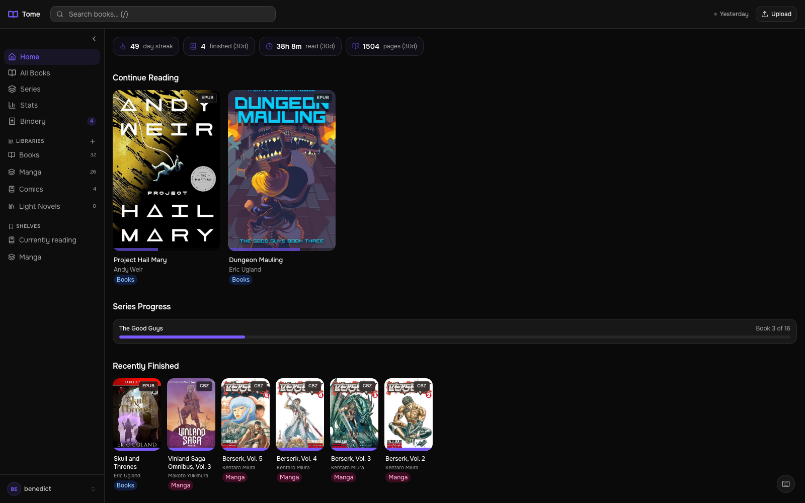
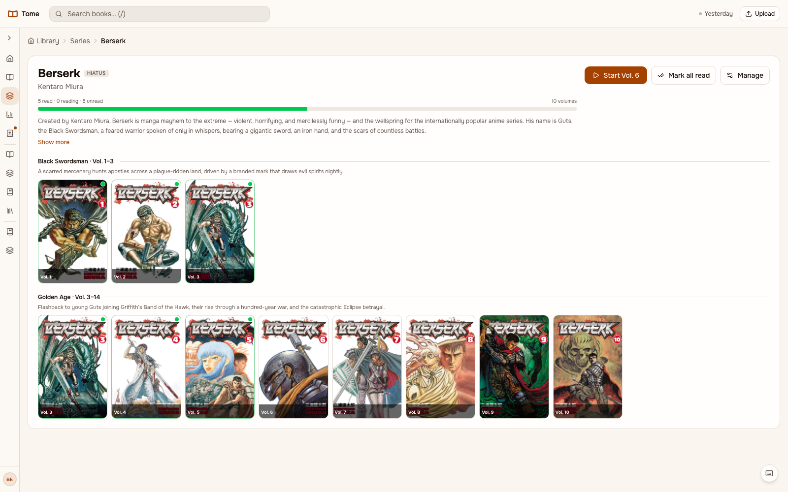
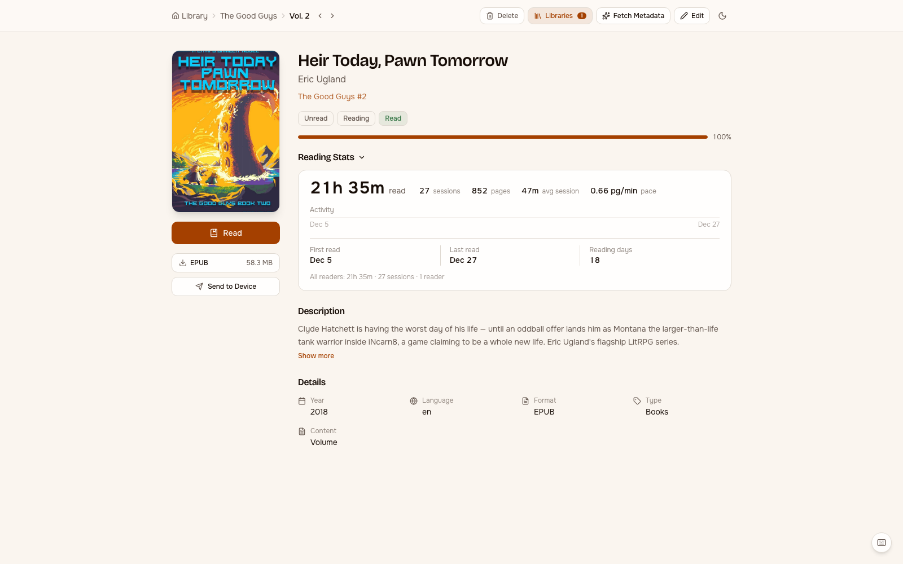
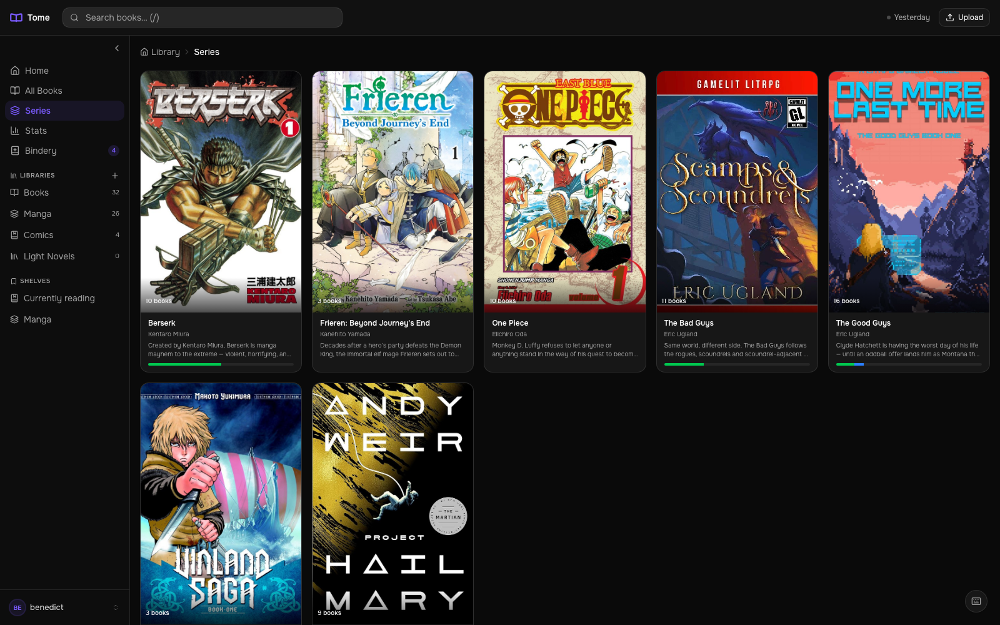
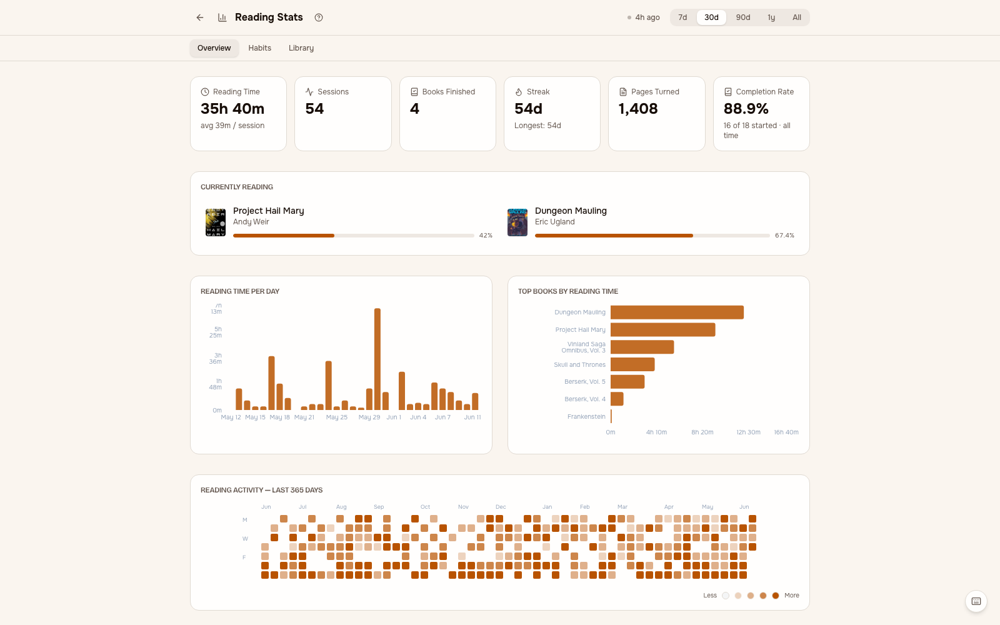
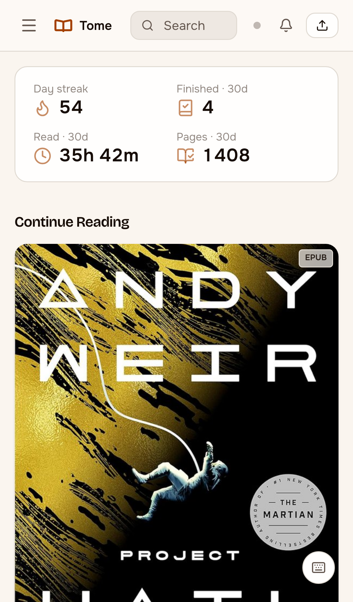
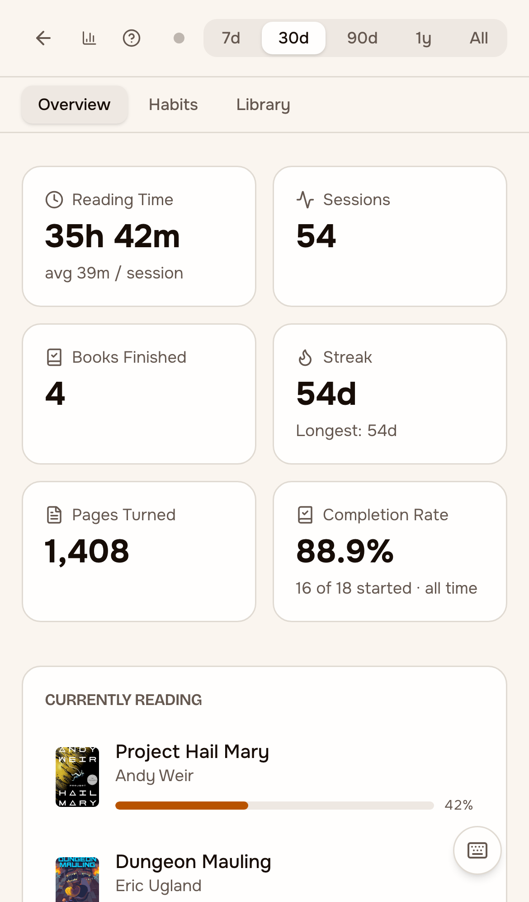
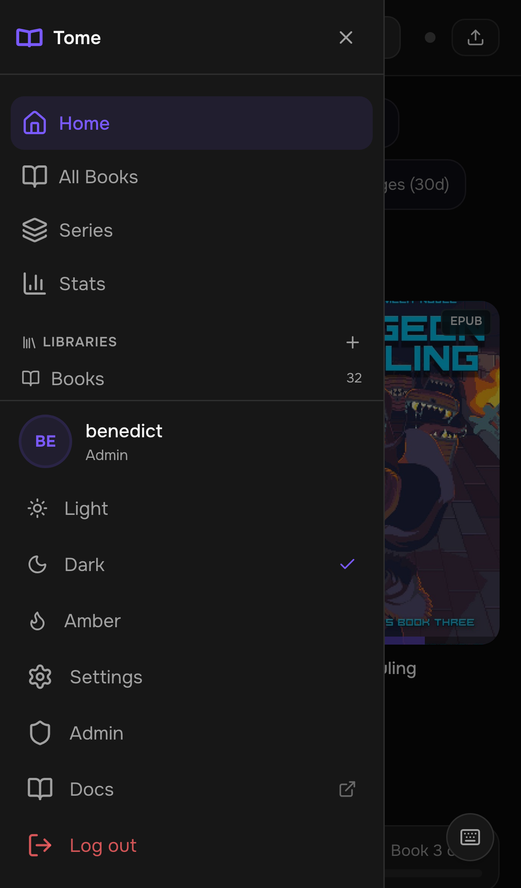
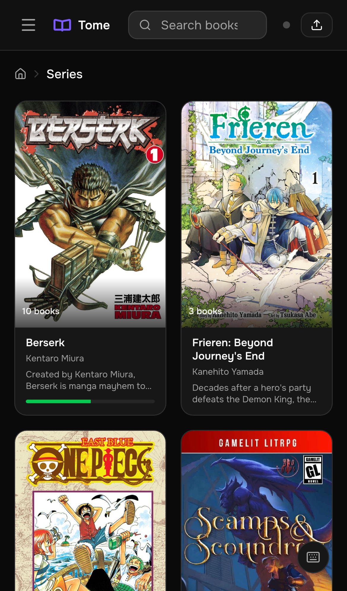
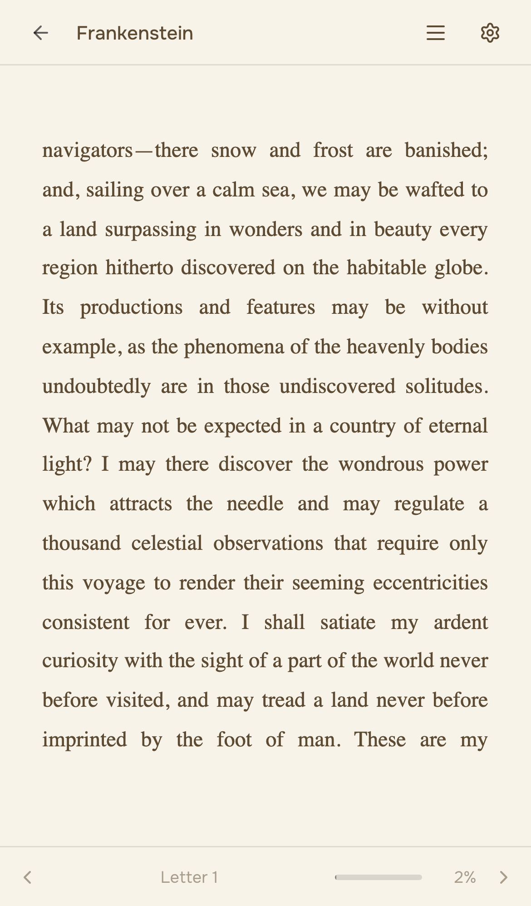

<p align="center">
  
</p>

# Tome

[](https://github.com/bndct-devops/tome/actions/workflows/docker.yml)
[](https://github.com/bndct-devops/tome/releases)
[](LICENSE)
[](https://github.com/bndct-devops/tome/pkgs/container/tome)

A self-hosted ebook library server that knows how you read -- not just what you own.

Most library servers stop at file management. Tome connects to your e-reader via a custom [KOReader](https://koreader.rocks) plugin, records every reading session with page-level granularity, syncs positions bidirectionally between device and browser, and turns all of it into stats that get sharper the more you read.

Built with FastAPI, React, and SQLite. Ships as a single Docker image.

> **[Documentation](https://tome.bndct.sh/docs)** · **[Why Tome?](https://tome.bndct.sh/why)** · **[Blog](https://tome.bndct.sh/blog)**

## Highlights

- **TomeSync** -- custom KOReader plugin records reading sessions, syncs positions bidirectionally (device to web, web to device), and works fully offline. This is what makes Tome different. [Details](docs/koreader-plugin.md)
- **Reading stats** -- session tracking, streaks, time-of-day heatmaps, reading pace, completion estimates, genre trends, monthly comparisons, and per-book breakdowns -- all powered by real session data from your e-reader
- **Metadata from 3 sources** -- fetch and compare metadata from [Hardcover](https://hardcover.app), Google Books, and OpenLibrary with a side-by-side diff UI
- **Built-in reader** -- EPUBs, manga (CBZ/CBR), and PDFs render directly in the browser. Two-page spread, RTL mode, webtoon scroll, pinch-to-zoom on mobile. [Details](docs/reader.md)
- **Bindery** -- an inbox for incoming books. Drop files in a folder, review pre-filled metadata, accept into your library. Optional auto-import on a schedule. [Details](docs/bindery-deployment.md)
- **Scribe** -- a Claude Code Skill for conversational batch ingest, metadata refresh, series-wide audits, and series-level annotation (arc breakdowns, publication status). Uses API tokens for auth and talks to Tome over HTTP. [Details](docs/scribe.md)
- **OPDS feed** -- browse and download from KOReader, Panels, Chunky, or any OPDS client
- **Themes** -- 3 built-in (light, dark, amber) plus fully custom themes via 10-value hex palette

Plus: series browsing with story arcs and publication status, bulk operations, libraries with icons, shelves (saved filters), Quick Connect (6-char code sign-in), OPDS PINs (e-ink-friendly passwords), role-based access control, per-user book visibility, user-level API tokens, audit logging, and a bulk import script. [Full feature list](docs/features.md)

## How is Tome different?

There are several self-hosted ebook tools — here's where Tome sits.

| | Tome | Calibre-Web | Komga | Kavita |
|---|---|---|---|---|
| **Reading session tracking** (time, pace, streaks from your e-reader) | ✅ via TomeSync plugin | ❌ | ❌ | ❌ |
| **Bidirectional position sync** with KOReader | ✅ | partial (KOSync) | ❌ | partial |
| **Built-in EPUB + manga reader** | ✅ | ✅ | manga only | ✅ |
| **Stats / reading insights** | ✅ rich | minimal | minimal | minimal |
| **Single-binary deploy** | ✅ Docker, FastAPI + SQLite | requires Calibre install | ✅ | ✅ |
| **Comics & novels in one place** | ✅ | EPUB-focused | comics-focused | ✅ |
| **Maturity** | v1.0 | mature, dated UI | mature | mature |

Pick **Calibre-Web** if you want the largest ecosystem and don't mind the dated UI. **Komga** if you're comics/manga-only. **Kavita** if you want a featureful all-rounder. **Tome** if reading-session tracking and KOReader integration are what you actually want — that's what it's built around.


*Filter, sort, and browse your library. Bulk select for metadata edits, library assignment, or export.*


*Drill into a series to see every volume, track progress per book, and pick up where you stopped.*


*Full metadata view with cover, description, tags, and one-click reading.*


*All your series at a glance with volume counts and descriptions.*


*Reading activity, streaks, session history, and time-of-day patterns.*

### Mobile

Tome works as a PWA on mobile. Pin it to your home screen for a native app feel.

| | | | | |
|---|---|---|---|---|
|  |  |  |  |  |

## Quick Start

```bash
docker run -d \
  --name tome \
  --restart unless-stopped \
  -p 8080:8080 \
  -v ./data:/data \
  -v ./books:/books \
  -v ./bindery:/bindery \
  ghcr.io/bndct-devops/tome:latest
```

Open `http://localhost:8080` and follow the setup wizard to create your admin account.

Or with Docker Compose -- the canonical `docker-compose.yml` in this repo is portable; clone and `docker compose up -d`. See `docs/examples/` for setups specific to Unraid and similar.

### Volumes

| Mount | Purpose |
|-------|---------|
| `/data` | SQLite database and cover cache |
| `/books` | Ebook library (read-only is fine) |
| `/bindery` | Incoming folder for new books |

### Environment Variables

| Variable | Required | Default | Description |
|----------|----------|---------|-------------|
| `TOME_SECRET_KEY` | Yes | -- | JWT signing secret |
| `TOME_DATA_DIR` | No | `/data` | DB and cover cache |
| `TOME_LIBRARY_DIR` | No | `/books` | Library root |
| `TOME_INCOMING_DIR` | No | `/bindery` | Bindery folder |
| `TOME_PORT` | No | `8080` | HTTP port |
| `TOME_HARDCOVER_TOKEN` | No | -- | [Hardcover](https://hardcover.app) API token for metadata |
| `TOME_AUTO_IMPORT` | No | `false` | Auto-import files from the bindery on a schedule |
| `TOME_AUTO_IMPORT_INTERVAL` | No | `300` | Seconds between auto-import scans |
| `TOME_SCAN_WORKERS` | No | `1` | Parallel scan workers (>1 = multi-process; ~60–80 MB each) |

### Supported Formats

| Format | Reader | Notes |
|--------|--------|-------|
| EPUB | Text reader | CFI position tracking |
| CBZ | Comic reader | Streaming page delivery |
| CBR | Comic reader | Auto-repacked to ZIP |
| PDF | Browser viewer | Served directly |

## Development

Requirements: Python 3.12+, Node.js 18+

```bash
./dev.sh   # starts backend :8080 + frontend :5173
```

| Layer | Technology |
|-------|------------|
| Backend | Python 3.12+ / FastAPI |
| Database | SQLite (WAL) / SQLAlchemy 2.0 |
| Frontend | React 19 / Vite / TypeScript |
| Styling | Tailwind CSS 4 |
| Auth | JWT (python-jose) |

See [CONTRIBUTING.md](CONTRIBUTING.md) for project conventions and PR guidelines.

## Documentation

- [Reader](docs/reader.md) -- EPUB, comic/manga reader, keyboard shortcuts, ComicInfo.xml
- [KOReader Plugin](docs/koreader-plugin.md) -- TomeSync setup, sync behavior, offline support
- [Bindery](docs/bindery-deployment.md) -- setting up the incoming book inbox
- [Scribe](docs/scribe.md) -- Claude Code Skill for batch ingest, metadata refresh, and series audits
- [Import Script](docs/import.md) -- bulk importing an existing collection from filenames
- [Features](docs/features.md) -- Quick Connect, OPDS PINs, permissions, themes, API tokens, and more

## Acknowledgements

- [KOReader](https://koreader.rocks) -- the open source e-reader app that Tome's sync plugin and OPDS integration are built for
- [Hardcover](https://hardcover.app) -- book metadata and cover art API
- [foliate-js](https://github.com/johnfactotum/foliate-js) -- the EPUB rendering engine powering Tome's built-in reader
- Substantial portions of Tome were developed in collaboration with [Claude Code](https://claude.ai/code)

## License

AGPL-3.0 — see [LICENSE](LICENSE)
